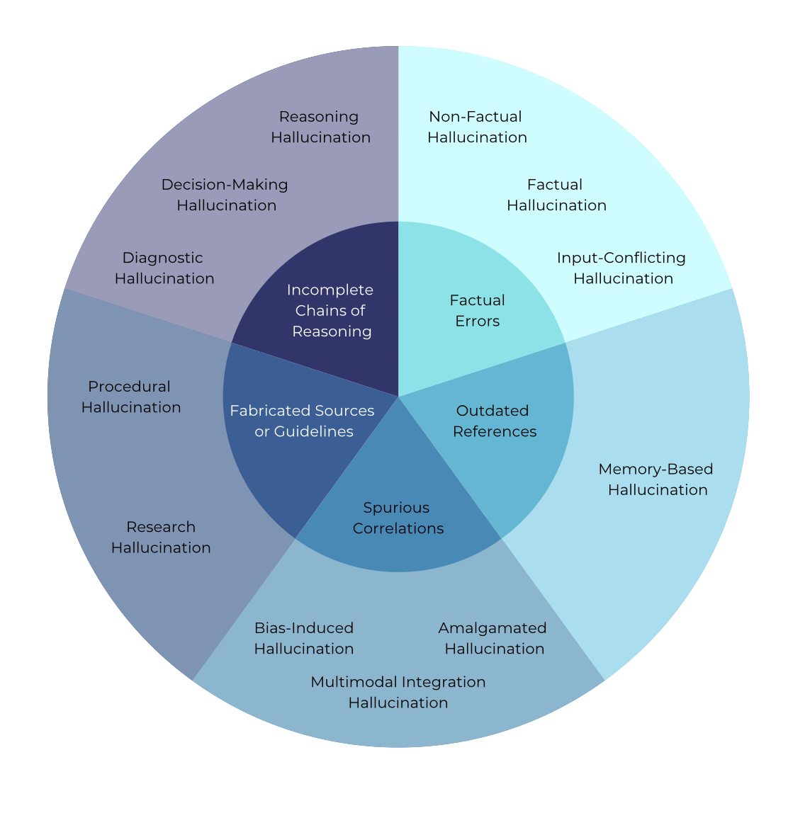

<div align=center>

</div>
<h2 align="center"><a href="https://www.medrxiv.org/content/10.1101/2025.02.28.25323115v1"> Medical Hallucination in Foundation Models and Their Impact on Healthcare </a></h2>
<h5 align="center"> If you like our project, please give us a star ⭐ on GitHub for the latest update.</h5>

<h5 align="center">


   [](https://www.medrxiv.org/content/10.1101/2025.02.28.25323115v1)


</h5>

## Medical Hallucination in Foundation Models and Their Impact on Healthcare (2025)
Foundation Models that are capable of processing and generating multi-modal data have transformed AI’s role in medicine. However, a key limitation of their reliability is hallucination, where inaccurate or fabricated information can impact clinical decisions and patient safety. We define **medical hallucination** as any instance in which a model generates misleading medical content. This paper examines the unique characteristics, causes, and implications of medical hallucinations, with a particular focus on how these errors manifest themselves in real-world clinical scenarios. Our contributions include (1) a taxonomy for understanding and addressing medical hallucinations, (2) benchmarking models using medical hallucination dataset and physician-annotated LLM responses to real medical cases, providing direct insight into the clinical impact of hallucinations, and (3) a multi-national clinician survey on their experiences with medical hallucinations. Our results reveal that inference techniques such as Chain-of-Thought (CoT) and Search Augmented Generation can effectively reduce hallucination rates. However, despite these improvements, non-trivial levels of hallucination persist. These findings underscore the ethical and practical imperative for robust detection and mitigation strategies, establishing a foundation for regulatory policies that prioritize patient safety and maintain clinical integrity as AI becomes more integrated into healthcare. The feedback from clinicians highlights the urgent need for not only technical advances but also for clearer ethical and regulatory guidelines to ensure patient safety.


##  📣 News
[2025-03-03] 🎉🎉🎉 Our preprint paper has been submitted to [medRxiv](https://www.medrxiv.org/content/10.1101/2025.02.28.25323115v1).

## Contents
- [What makes Medical Hallucination Special?](#difference)
- [Hallucinations in Medical LLMs](#llms)
- [Medical Hallucination Benchmarks](#benchmarks)
- [Detection Methods for Medical Hallucination](#detection)
- [Mitigation Methods for Medical Hallucination](#mitigation)

## What makes Medical Hallucination Special? <a name="difference"></a>

<figure>
    
    <figcaption>Figure 1. A visual taxonomy of medical hallucinations in LLMs, organized into five main clusters.</figcaption>
</figure>

<br><br>


Our primary contributions include:

1. A **taxonomy** for medical hallucination in Large Language Models
2. **Benchmarking models** using a medical hallucination dataset and physician-annotated LLM responses to real medical cases, providing direct insight into the clinical impact of hallucinations.
3. A **multi-national clinician survey** on their experiences with medical hallucinations.

These contributions collectively *advance our understanding of medical hallucinations and their mitigation strategies*, with implications extending to regulatory frameworks and best practices for the deployment of AI in clinical
 settings.

## Hallucinations in Medical LLMs <a name="llms"></a>
Please refer to table 1 of our paper for examples of medical hallucination in clinical tasks, and table 2 for an organized taxonomy of medical hallucination. 
| Title | Institute | Date | Code
| :---------------------------------------------------------------------------------------------------------------------------------------------------------------------------------- | :------------------: | :-----------: | :-------------: |
| [MedHalu: Hallucinations in Responses to Healthcare Queries by Large Language Models](https://arxiv.org/abs/2409.19492) | University of Surrey<br>Georgia Institute of Technology | 2024-09 | N/A
| [Creating trustworthy llms: Dealing with hallucinations in healthcare ai](https://arxiv.org/abs/2311.01463) |  University of Washington Bothell <br>Kaiser Permanente | 2023-09 | N/A
| [Knowledge Overshadowing Causes Amalgamated Hallucination in Large Language Models](https://arxiv.org/pdf/2407.08039) |  University of Illinois Urbana-Champaign<br>The Hong Kong Polytechnic University<br>Stanford University | 2024-07 | N/A
| [Mechanistic Understanding and Mitigation of Language Model Non-Factual Hallucinations](https://arxiv.org/pdf/2403.18167v2) |  University of Toronto<br>McGill University<br>Mila– Québec AI Institute<br>University of California, Riverside | 2024-06 | N/A
| [Language models are susceptible to incorrect patient self diagnosis in medical applications](https://arxiv.org/pdf/2309.09362) | University of Maryland, College Park<br>Johns Hopkins University | 2023-09 | N/A
| [The Dawn After the Dark: An Empirical Study on Factuality Hallucination in Large Language Models](https://arxiv.org/pdf/2401.03205) | Renmin University of China<br>Université de Montréal | 2024-01 | https://github.com/RUCAIBox/HaluEval-2.0

## Medical Hallucination Benchmarks <a name="benchmarks"></a>
Please refer to table 3 of our paper for details on medical hallucination benchmarks. 
| Title | Institute | Date | Code 
| :---------------------------------------------------------------------------------------------------------------------------------------------------------------------------------- | :------------------: | :-----------: | :-------------: |
| [Med-HALT: Medical Domain Hallucination Test for Large Language Models](https://arxiv.org/abs/2307.15343) | Saama AI Research | 2023-10 | [https://medhalt.github.io/](https://medhalt.github.io/)
| [Hallucination benchmark in medical visual question answering](https://arxiv.org/abs/2401.05827v2) | University College London | 2024-04 | https://github.com/knowlab/halt-medvqa
| [Detection, Diagnosis, and Explanation: A Benchmark for Chinese Medial Hallucination Evaluation](https://aclanthology.org/2024.lrec-main.428/) | Peking University <br> Ministry of Education <br> Beijing Jiaotong University| 2024-05 | [link to drive](https://drive.google.com/drive/folders/1DrdovKwZIh6AX_JjL8BVpUmI9djiIwn_)
| [MedVH: Towards Systematic Evaluation of Hallucination for Large Vision Language Models in the Medical Context](https://arxiv.org/abs/2407.02730) | The Ohio State University <br> University of Oxford| 2024-07 | https://github.com/dongzizhu/MedVH
| [Detecting and Evaluating Medical Hallucinations in Large Vision Language Models](https://arxiv.org/abs/2406.10185) | Fudan University <br> Tencent Youtu Lab <br> Cognition and Intelligent Technology Laboratory <br>  Ministry of Education <br> AI and Unmanned Systems Engineering Research Center of Jilin Province| 2024-06 | https://github.com/ydk122024/Med-HallMark
| [K-QA: AReal-World Medical Q&A Benchmark](https://arxiv.org/pdf/2401.14493) | K Health Inc <br> The Hebrew University of Jerusalem | 2024-01 | https://github.com/Itaymanes/K-QA
| [Grounding LLMs to In-prompt Instructions: Reducing Hallucinations Caused by Static Pre-training Knowledge](https://aclanthology.org/2024.safety4convai-1.1/) | Heriot-Watt University | 2024-05 | https://github.com/AddleseeHQ/in-prompt-grounding
| [Medical Expert Annotations of Unsupported Facts in Doctor-Written and LLM-Generated Patient Summaries](https://physionet.org/content/ann-pt-summ/1.0.0/) | University of Münster <br> MIT <br> Duke University | 2024-04 | https://github.com/stefanhgm/patient_summaries_with_llms
| [MedHallBench: A New Benchmark for Assessing Hallucination in Medical Large Language Models](https://arxiv.org/abs/2412.18947) | University of Warwick <br> Cranfield University <br> University of Oxford | 2025-01 | N/A

## Dection Methods for Medical Hallucination <a name="detection"></a>
### Type 1: Factual Verification <a name="detection"></a>
| Title | Institute | Date | Code
| :---------------------------------------------------------------------------------------------------------------------------------------------------------------------------------- | :------------------: | :-----------: | :-------------: |
| [Complex Claim Verification with Evidence Retrieved in the Wild](https://aclanthology.org/2024.naacl-long.196.pdf) | The University of Texas at Austin | 2025-01 | https://github.com/jifan-chen/Fact-checking-via-Raw-Evidence
 | [FACTSCORE: Fine-grained Atomic Evaluation of Factual Precision in Long Form Text Generation](https://aclanthology.org/2023.emnlp-main.741.pdf) | University of Washington <br> University of Massachusetts Amherst <br> Allen Institute for AI <br> Meta AI | 2023-12 | https://github.com/shmsw25/FActScore

 ### Type 2: Summary Consistency Verification <a name="detection"></a>
| Title | Institute | Date | Code
| :---------------------------------------------------------------------------------------------------------------------------------------------------------------------------------- | :------------------: | :-----------: | :-------------: |
| [Answers Unite! Unsupervised Metrics for Reinforced Summarization Models](https://aclanthology.org/D19-1320.pdf) | CNRS <br> Sorbonne Université<br> LIP6 <br> reciTAL | 2019-11 | https://github.com/ThomasScialom/summa-qa
| [Asking and Answering Questions to Evaluate the Factual Consistency of Summaries](https://aclanthology.org/2020.acl-main.450.pdf) | New York University <br> Facebook AI <br>  CIFAR Associate Fellow | 2020-07 | https://github.com/W4ngatang/qags
 | [QuestEval: Summarization Asks for Fact-based Evaluation](https://aclanthology.org/2021.emnlp-main.529.pdf) | CNRS <br> Sorbonne Université<br> LIP6 <br> reciTAL <br> New York University | 2021-11 | https://github.com/ThomasScialom/QuestEval 
 | [Ranking Generated Summaries by Correctness: An Interesting but Challenging Application for Natural Language Inference](https://aclanthology.org/P19-1213.pdf) | Amazon <br> Technische Universitat <br> Bar-Ilan University, Ramat-Gan | 2019-08 | https://tudatalib.ulb.tu-darmstadt.de/handle/tudatalib/2002

 ### Type 3: Uncertainty-Based Hallucination Detection <a name="detection"></a>
| Title | Institute | Date | Code
| :---------------------------------------------------------------------------------------------------------------------------------------------------------------------------------- | :------------------: | :-----------: | :-------------: |
| [Looking for a Needle in a Haystack: A Comprehensive Study of Hallucinations in Neural Machine Translation](https://aclanthology.org/2023.eacl-main.75.pdf) |Instituto de Telecomunicações <br> Instituto Superior Técnico & LUMLIS <br> Unbabel <br> University of Edinburgh | 2023-05 | https://github.com/deep-spin/hallucinations-in-nmt
| [Enhancing Uncertainty-Based Hallucination Detection with Stronger Focus](https://arxiv.org/pdf/2311.13230) | Shanghai Jiaotong University <br> Amazon AWS AI <br> Westlake University <br> IGSNRR, Chinese Academy of Sciences| 2023-11 | https://github.com/zthang/focus
| [Detecting hallucinations in large language models using semantic entropy](https://www.nature.com/articles/s41586-024-07421-0) | University of Oxford | 2024-06 | https://github.com/jlko/semantic_uncertainty <br> https://github.com/jlko/long_hallucinations
| [Decomposing Uncertainty for Large Language Models through Input Clarification Ensembling](https://arxiv.org/pdf/2311.08718) | UC Santa Barbara <br> MIT-IBM Watson AI Lab, IBM Research <br> MIT CSAIL| 2024-06 | https://github.com/UCSB-NLP-Chang/llm_uncertainty

## Mitigation Methods for Medical Hallucination <a name="mitigation"></a>
| Title | Institute | Date | Code
| :---------------------------------------------------------------------------------------------------------------------------------------------------------------------------------- | :------------------: | :-----------: | :-------------: |
| [SYNFAC-EDIT: Synthetic Imitation Edit Feedback for Factual Alignment in Clinical Summarization](https://arxiv.org/pdf/2402.13919) | University of Massachusetts, Amherst <br> Fudan University <br> University of Massachusetts, Lowell | 2024-10 | N/A
| [Benchmarking Retrieval-Augmented Generation for Medicine](https://aclanthology.org/2024.findings-acl.372.pdf) | Univeristy of Virginia <br> National Library of Medicine <br> National Institutes of Health | 2024-08 | https://teddy-xionggz.github.io/benchmark-medical-rag/
| [Enhancement of the Performance of Large Language Models in Diabetes Education through Retrieval-Augmented Generation: Comparative Study](https://www.jmir.org/2024/1/e58041) | State Key Laboratory of Ophthalmology <br> Zhongshan Ophthalmic Center <br> Sun Yat-sen University <br> Guangdong Provincial Key Laboratory of Ophthalmology and Visual Science <br> Guangdong Provincial Clinical Research Center for Ocular Diseases <br> Research Centre for SHARP Vision <br> The Hong Kong Polytechnic University <br> Peking University Third Hospital | 2024-08 | N/A
| [Improving Retrieval-Augmented Generation in Medicine with Iterative Follow-up Questions](https://arxiv.org/pdf/2408.00727) | University of Virginia <br> National Institutes of Health <br> University of Illinois Urbana-Champaign | 2024-10 | N/A
| [Knowledge Graphs, Large Language Models, and Hallucinations: An NLP Perspective](https://arxiv.org/pdf/2411.14258) | Aalborg University <br> TU Wien <br> Institute of Logic and Computation | 2024-11 | N/A
| [CoMT: Chain-of-Medical-Thought Reduces Hallucination in Medical Report Generation](https://arxiv.org/pdf/2406.11451v4) | Fudan University <br> Tencent YouTu Lab <br> Xiamen University <br> Cognition and Intelligent Technology Laboratory <br> Institute of Meta-Medical <br> Ministry of Education <br> Jilin Provincial Key Laboratory of Intelligence Science and Engineering | 2025-02 | https://github.com/FRENKIE-CHIANG/CoMT
| [Towards Mitigating Hallucination in Large Language Models via Self-Reflection](https://arxiv.org/pdf/2310.06271) | Center for Artificial Intelligence Research (CAiRE) <br> Hong Kong University of Science and Technology| 2023-10 | https://github.com/ziweiji/Self_Reflection_Medical
| [Mitigating Hallucinations in Large Language Models via Semantic Enrichment of Prompts: Insights from BioBERT and Ontological Integration](https://aclanthology.org/2024.clib-1.30/) | Sofia University | 2024-09 | N/A
| [Chain-of-Knowledge: Grounding Large Language Models via Dynamic Knowledge Adapting over Heterogeneous Sources](https://export.arxiv.org/pdf/2305.13269) | DAMOAcademy, Alibaba Group <br> Nanyang Technological University <br> Singapore University of Technology and Design <br> Salesforce Research <br> Hupan Lab | 2024-02 | https://github.com/DAMO-NLP-SG/chain-of-knowledge

## 📑 Citation

Please consider citing 📑 our paper if our repository is helpful to your work, thanks sincerely!

```
@article {Kim2025.02.28.25323115,
	author = {Kim, Yubin and Jeong, Hyewon and Chen, Shen and Li, Shuyue Stella and Lu, Mingyu and Alhamoud, Kumail and Mun, Jimin and Grau, Cristina and Jung, Minseok and Gameiro, Rodrigo R and Fan, Lizhou and Park, Eugene and Lin, Tristan and Yoon, Joonsik and Yoon, Wonjin and Sap, Maarten and Tsvetkov, Yulia and Liang, Paul Pu and Xu, Xuhai and Liu, Xin and McDuff, Daniel and Lee, Hyeonhoon and Park, Hae Won and Tulebaev, Samir R and Breazeal, Cynthia},
	title = {Medical Hallucination in Foundation Models and Their Impact on Healthcare},
	elocation-id = {2025.02.28.25323115},
	year = {2025},
	doi = {10.1101/2025.02.28.25323115},
	publisher = {Cold Spring Harbor Laboratory Press},
	abstract = {Foundation Models that are capable of processing and generating multi-modal data have transformed AI{\textquoteright}s role in medicine. However, a key limitation of their reliability is hallucination, where inaccurate or fabricated information can impact clinical decisions and patient safety. We define medical hallucination as any instance in which a model generates misleading medical content. This paper examines the unique characteristics, causes, and implications of medical hallucinations, with a particular focus on how these errors manifest themselves in real-world clinical scenarios. Our contributions include (1) a taxonomy for understanding and addressing medical hallucinations, (2) benchmarking models using medical hallucination dataset and physician-annotated LLM responses to real medical cases, providing direct insight into the clinical impact of hallucinations, and (3) a multi-national clinician survey on their experiences with medical hallucinations. Our results reveal that inference techniques such as Chain-of-Thought (CoT) and Search Augmented Generation can effectively reduce hallucination rates. However, despite these improvements, non-trivial levels of hallucination persist. These findings underscore the ethical and practical imperative for robust detection and mitigation strategies, establishing a foundation for regulatory policies that prioritize patient safety and maintain clinical integrity as AI becomes more integrated into healthcare. The feedback from clinicians highlights the urgent need for not only technical advances but also for clearer ethical and regulatory guidelines to ensure patient safety. A repository organizing the paper resources, summaries, and additional information is available at https://github.com/mitmedialab/medical_hallucination.Competing Interest StatementThe authors have declared no competing interest.Funding StatementThis study did not receive any funding.Author DeclarationsI confirm all relevant ethical guidelines have been followed, and any necessary IRB and/or ethics committee approvals have been obtained.YesThe details of the IRB/oversight body that provided approval or exemption for the research described are given below:This study received an Institutional Review Board (IRB) exemption from MIT COUHES (Committee On the Use of Humans as Experimental Subjects) under exemption category 2 (Educational Testing, Surveys, Interviews, or Observation). The IRB determined that this research, involving surveys with professionals on their perceptions and experiences with AI/LLMs, posed minimal risk to participants and met the criteria for exemption.I confirm that all necessary patient/participant consent has been obtained and the appropriate institutional forms have been archived, and that any patient/participant/sample identifiers included were not known to anyone (e.g., hospital staff, patients or participants themselves) outside the research group so cannot be used to identify individuals.YesI understand that all clinical trials and any other prospective interventional studies must be registered with an ICMJE-approved registry, such as ClinicalTrials.gov. I confirm that any such study reported in the manuscript has been registered and the trial registration ID is provided (note: if posting a prospective study registered retrospectively, please provide a statement in the trial ID field explaining why the study was not registered in advance).Yes I have followed all appropriate research reporting guidelines, such as any relevant EQUATOR Network research reporting checklist(s) and other pertinent material, if applicable.YesMed-HALT is a publicly available dataset and NEJM Medical Records can be access after the sign-up.https://www.nejm.org/browse/nejm-article-category/clinical-cases?date=past5Yearshttps://github.com/medhalt/medhalt},
	URL = {https://www.medrxiv.org/content/early/2025/03/03/2025.02.28.25323115},
	eprint = {https://www.medrxiv.org/content/early/2025/03/03/2025.02.28.25323115.full.pdf},
	journal = {medRxiv}
}
```
